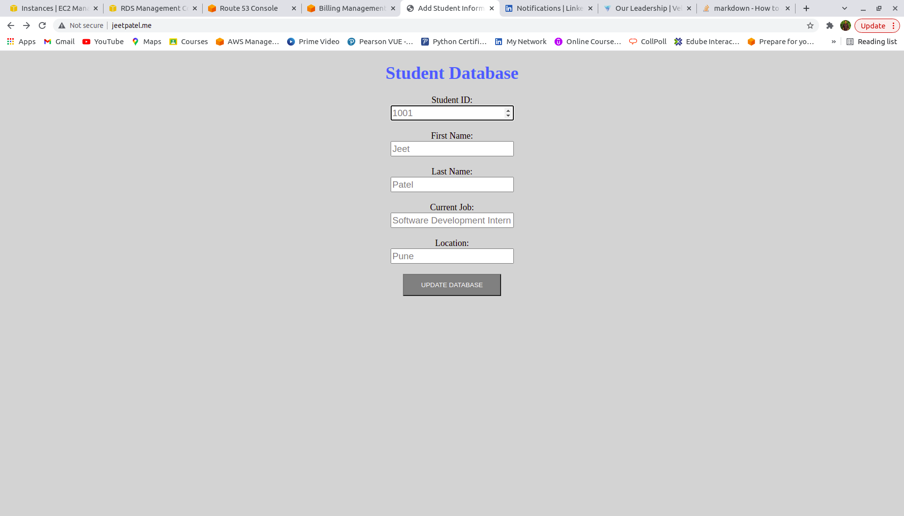
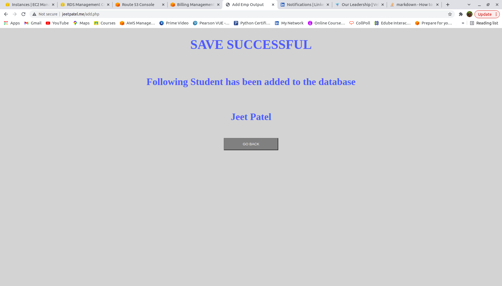

# insaid-internship-task

1. Describe basic aspects of AWS Elastic Compute Cloud.\
-> AWS EC2 provides computing capacity. Using EC2 service, you can create virtual machines/servers as per your requirements(operating system, no. of cpus, memory, network performance,etc). This service eliminates the need of hardware, so you can develop and deploy your applications more faster. There are different pre-built AMIs(Amazon Machine Image) which is the operating system of virtual machine. You can also create your own custom AMI. EC2 provides different instance types according to network performance, storage performance, memory. It also provides a key-pair for the security purpose which consists of public key and private key. So AWS keeps the public key and private key is given to you, so by using that private key you can login to your EC2 instance.

2. How to create a virtual machine instance in AWS EC2.\
-> Login to AWS Management Console and navigate to EC2 service dashboard.\
-> Click on 'Launch Instance' button and it will redirect you to page which contains several steps.\
-> First step is to choose AMI i.e. OPerating System.\
-> In second step, there is a list of instance types which you have to choose as per your requirement. If your application is not that big or doesn't require much network performance, cpu utilization then you can go for 't2.micro' as it also included in free tier.\
-> After choosing the instance type, you have to configure your instance, like specify no. of instances you want to deploy, specify the vpc(virtual private cloud) in which you want to deploy your instance, specify subnet,availability zone, specify IAM role if require, so on. For simple application and no special requirements, you can go with the default settings.\
-> After that you can add additional storage if you want otherwise proceed to next.\
-> In this step, you can specify tags. Tags are key-value pair which helps you to categorize your instances, for ex. name:instacne_name.\
-> Next you have configure security group. Security group are like firewall to this EC2 instance, it helps to control incoming and outgoing traffic. You can create a new security group by specifying inbound rules(control incoming traffic) and outbound rule(control outgoing traffic) or you can go with the default security group. For running a website on Apache server, you must open a port 80 by defining source as anywhere in inbound rules in-order to have your application visible.\
-> Next is review and launch, in which you can review all above configurations defined and then click on launch.\
-> After clicking on launch, one dailog box will appear in which yo uhave to create new key-pair or you can also use an existing key-pair.

3. How to install an Apache webserver on AWS EC2 Instance.\
-> After logging into your EC2 instance, you have to update it by running 'sudo yum update -y' command. Then run this command: 'sudo yum install httpd -y'.

4. How we can connect an AWS EC2 instance to a MySQL server database.\
-> First you have to install mysql-client in your EC2 instance by running command : 'sudo yum install mysql -y'.\
-> After that, run this command: 'mysql -h hostname -u username -P 3306 -p' and then you have to give password of the database.

5. How to connect a domain to your website using Route 53.\
-> In route53 management console, create a hosted zone. You can create either public or private hosted zone. In this case, we will create a public hosted zone.\
-> Create records in public hosted zone. In which you have to specify domain name and where you want to route the traffic.

6. Demonstrate the hosted website.\
-> The hosted website will be available on http://jeetpatel.me/. 
 \
 
 
7. What are the key factors to keep in mind during the process?\
-> First is choose the correct EC2 instance type as per requirement. For ex. if you choose larger instance type for a small use-case then it will charge you more.\
-> Make sure you configure apache server such that it must have an extension of programming language which you are using.\
-> Configure your security group properly. It must have an inbound rule for running your website on apache server otherwise your website will not be visible.\
-> For AWS RDS, make sure you configure your DB instance properly to avoid extra charges and note down the master username and password because it won't be visible again.

8. Clean up the project environment and avoid future costs.\
-> After completing the assignment/project make sure that you delete all the instances like ec2 instance, rds instance, etc. to avoid further charges.
